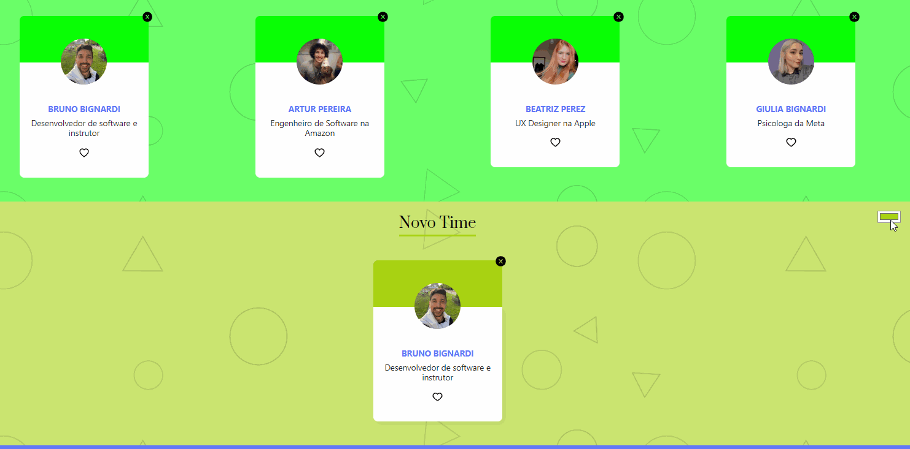

# Organo 2.0
## About

Organo 2.0 is just a remake of a project I've made a long time ago with refactored parts and some new features.  
Organo is an application made to register and expose the contributors of a Brazilian IT school with their respective name, occupation, images and team on dynamic cards..
### NEWS -> 
*now the user can add a new customized team with a new dedicated form. 

*the color of each existing teams can also be changed as pleased. 

*now cards can be deleted with just one click. 

*a favorites feature was implemented with an icon at the bottom of each card. 

*now the app is fully flexible, suitable to every screen format. 
#

## Screenshot
#

### Available Scripts
#

In the project directory, you can run:

### `npm start`
To run the app in the development mode.\
Open [http://localhost:3000](http://localhost:3000) to view it in your browser.
